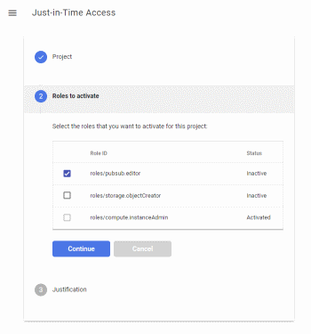
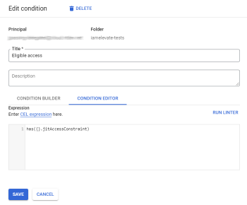

# Just-In-Time Access

Just-In-Time Access is an open source application that lets you implement just-in-time privileged access to Google Cloud resources. 

Just-In-Time Access adds _eligible role bindings_ to Cloud IAM. Unlike a [regular
IAM role binding](https://cloud.google.com/iam/docs/overview#cloud-iam-policy), 
an eligible role binding doesn't grant the user access to a project yet:
Instead, a user first has to _activate_ the binding on demand by using the Just-In-Time Access application.
Activation is temporary and requires the user to provide a justification (like a bug or case number).

You can use _eligible role bindings_ to grant users privileged (pr break-glass) access to resources
without having to grant them permanent access. This type of just-in-time privileged access helps you to:

* Reduce the risk of users accidentally modifying or deleting resources ("fat-fingering").
* Create an audit trails that captures justifications for why privileged access was used.
* Conduct audits and reviews for analyzing past activity.


## Request just-in-time access

<a href='doc/Activation_1024.gif?raw=true'>

</a>

As a user, you can list the roles and resources you're _eligible_ to access by using the Just-In-Time Access
application. 

You can then _activate_ one or more role bindings and provide a justification for doing so. Just-In-Time Access
then [grants you temporary access](https://cloud.google.com/iam/docs/configuring-temporary-access)
to the resource.


## Grant just-in-time access

<a href='doc/Condition.png?raw=true'>

</a>

As an administrator, you can grant a role (to a user or group) and make it _eligible_ by adding a special IAM condition:

```
has({}.jitAccessConstraint)
```

You can create the binding for a specific project, or for an entire folder. Instead of granting eligible
access to individual users, you can also use groups.


## Audit just-in-time access

<a href='doc/AuditLog.png?raw=true'>

</a>

As an administrator, you can use Cloud Logging to review when and why eligible roles have been activated by users.  


## Deploying the application

Just-In-Time Access runs on App Engine (standard) and uses Identity-Aware-Proxy for authentication and authorization.

For detailed instructions on deploying Just-In-Time Access, see [Manage just-in-time privileged access to projects ](https://cloud.google.com/architecture/manage-just-in-time-privileged-access-to-project) on the Google Cloud website.

--- 

_Just-In-Time Access is an open-source project and not an officially supported Google product._

_All files in this repository are under the
[Apache License, Version 2.0](LICENSE.txt) unless noted otherwise._
