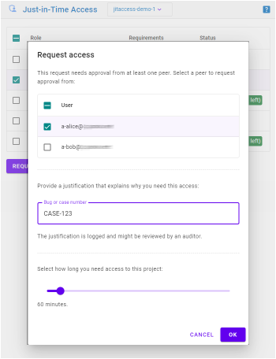
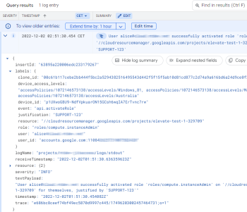

# Just-In-Time Access

Just-In-Time Access is an open source application that lets you implement just-in-time privileged access to Google Cloud resources. 

Just-In-Time Access works by introducing the notion of _eligible role bindings_ to Cloud IAM. Unlike a [regular
IAM role binding :octicons-link-external-16:](https://cloud.google.com/iam/docs/overview#cloud-iam-policy), 
an eligible role binding doesn't grant the user access to a project yet:
Instead, a user first has to _activate_ the binding on demand by using the Just-In-Time Access application. As an administrator,
you can decide whether activating a role requires approval, or whether users only need to provide a justification (like a bug or case number).

You can use _eligible role bindings_ to grant users privileged (or break-glass) access to resources
without having to grant them permanent access. This type of just-in-time privileged access helps you to:

* Reduce the risk of someone accidentally modifying or deleting resources. For example, when users have privileged access only when it's needed, it helps prevent them from running scripts at other times that unintentionally affect resources that they shouldn't be able to change.
* Create an audit trail that indicates why privileges were activated.
* Conduct audits and reviews for analyzing past activity.

## Activate roles on demand

As a user, you can activate a role in three steps:

1. Select the project you need to access
2. Select one or more roles to activate (from your list of eligible roles)
3. Enter a justification (like a bug or case number)

After validating your request, the application then
[grants you temporary access :octicons-link-external-16:](https://cloud.google.com/iam/docs/configuring-temporary-access)
to the project.

## Request approval to activate a role

For roles that require [multi-party approval](multi-party-approval.md), 
you can request access in four steps:

1. Select the project you need to access
2. Select the role to activate (from your list of eligible roles)
3. Select one or more peers to approve your request (peers are users that share the same level of access as you)
3. Enter a justification (like a bug or case number)

Your selected peers are notified via email and can approve your request. Once approved, the application 
[grants you temporary access :octicons-link-external-16:](https://cloud.google.com/iam/docs/configuring-temporary-access) to the project
and notifies you via email.

## Grant access

As an administrator, you can grant a role (to a user or group) and make it _eligible_ by adding a special IAM condition:

* `has({}.jitAccessConstraint)` (no approval required)
* `has({}.multiPartyApprovalConstraint)` ([multi-party approval](multi-party-approval.md) required) 

You can create the binding for a specific project, or for an entire folder. Instead of granting eligible
access to individual users, you can also use groups.

## Audit access

As an administrator, you can use Cloud Logging to review when and why eligible roles have been activated by users. 
For each activation, the Just-In-Time application writes an audit log entry that contains information about:

* the user that requested access
* the user's device, including satisfied [access levels :octicons-link-external-16:](https://cloud.google.com/access-context-manager/docs/manage-access-levels) 
* the project and role for which access was requested
* the justification provided by the user

## Deploy the application

Just-In-Time Access runs on App Engine (standard) and Cloud Run. The application
is stateless and uses [Identity-Aware-Proxy :octicons-link-external-16:](https://cloud.google.com/iap/docs/concepts-overview) for authentication and authorization, 
and the [Cloud Asset API :octicons-link-external-16:](https://cloud.google.com/asset-inventory/docs/reference/rest) and 
[IAM API :octicons-link-external-16:](https://cloud.google.com/iam/docs/reference/rest) to manage access.

For detailed instructions on deploying Just-In-Time Access, see
[Manage just-in-time privileged access to projects :octicons-link-external-16:](https://cloud.google.com/architecture/manage-just-in-time-privileged-access-to-project) on the Google Cloud website.
