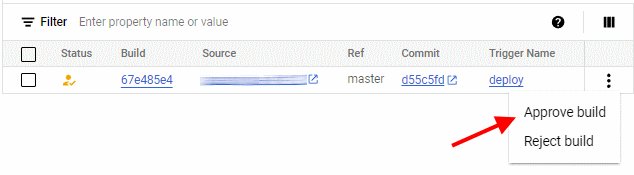

This article describes how you can set up continuous deployment to automate the process
of applying configuration changes or performing upgrades.

When you set up continuous deployment, your Git repository becomes the *source of truth*, and any
changes you make in that Git repository are automatically applied to JIT Groups. Using the
Git repository as source of truth and deploying changes automatically can have several
advantages, including the following:

+   Improved efficiency, because no manual work is required to roll out changes.
+   Improved reliability, because the process is fully automated and repeatable.
+   Improved traceability, because the Git commit log let you can trace all changes.
 
However, making your Git repository the source of truth also 
[introduces risks :octicons-link-external-16:](https://cloud.google.com/architecture/design-secure-deployment-pipelines-bp) 
and an improperly-secured Git repository can undermine the security of JIT Groups, and the
Google Cloud resources that JIT Groups manages access for:

+   Instead of trying to compromise JIT Groups or its Google Cloud project directly, bad actors
    might attempt to gain access to the Git repository and apply malicious changes to the Git repository.
+   If these malicious changes are applied automatically, they might allow the bad actor to escalate 
    their privileges and compromise the JIT Groups application, or impersonate the privileged service account
    that JIT Groups uses to provision access.

To help you mitigate these risks, this article describes a continuous deployment setup that
uses [Cloud Build :octicons-link-external-16:](https://cloud.google.com/build/docs/overview) to implement
the following safety measures:

+   **Pull instead of push**: Instead of letting an external CI/CD system such as GitHub Actions or GitLab _push_
    configuration changes to Google Cloud, you let Google Cloud _pull_ changes from your Git repository and apply them
    locally. 

    This approach avoids having to use workload identity federation or service account keys to grant the external
    CI/CD system privileged access to Google Cloud resources.
  
+   **Require build approvals**: All deployments to Google Cloud must be approved manually.

    This additional approval step adds a _last layer of defense_ that can prevent a Git repository compromise
    affect JIT Groups and your Google Cloud resources.


## Before you begin

Before you can configure the automatic deployment, you first need to connect Cloud Build to your Git repository and
enable required APIs:


1.  Open Cloud Shell or a local terminal.

    [Open Cloud Shell](https://console.cloud.google.com/?cloudshell=true){ .md-button }

1.  Authorize `gcloud`:

    ```sh
    gcloud auth login
    ```
    You can skip this step if you're using Cloud Shell.

1.  Set an environment variable to contain [your project ID](https://cloud.google.com/resource-manager/docs/creating-managing-projects):

    ```sh
    gcloud config set project PROJECT_ID
    ```

    Replace `PROJECT_ID` with the ID of the project to deploy JIT Groups in.

1.  Enable required APIs:

    === "App Engine"

        ```sh
        gcloud services enable appengine.googleapis.com serviceusage.googleapis.com
        ```

    === "Cloud Run"

        ```sh
        gcloud services enable cloudbuild.googleapis.com
        ```
    
1.  Connect Cloud Build to your Git repository. 

    === "GitHub"

        To connect Cloud Build to a GitHub repository, do the following:

        1.  [Create a host connection :octicons-link-external-16:](https://cloud.google.com/build/docs/automating-builds/github/connect-repo-github#connecting_a_github_host)
            to connect Cloud Build to GitHub.
        1.  [Link your GitHub repository :octicons-link-external-16:](https://cloud.google.com/build/docs/automating-builds/github/connect-repo-github#connecting_a_github_repository_2)
            to let Cloud Build access your repository contents.

    === "GitLab"

        To connect Cloud Build to a GitLab repository, do the following:

        1.  [Create a host connection :octicons-link-external-16:](https://cloud.google.com/build/docs/automating-builds/gitlab/connect-host-gitlab)
            to connect Cloud Build to GitLab.
        1.  [Link your GitLab repository :octicons-link-external-16:](https://cloud.google.com/build/docs/automating-builds/gitlab/connect-repo-gitlab)
            to let Cloud Build access your repository contents.


## Deploy automatically

Configure Cloud Build so that it triggers a build and runs `terraform apply` 
when your repository's mainline branch (`main` or `master`) changes:

1.  Create a service account for Cloud Build:

    ```sh
    DEPLOY_ACCOUNT=$(gcloud iam service-accounts create jitgroups-cloudbuild-deploy \
      --display-name "Service account for deployments " \
      --format "value(email)")
    ```

1.  Grant the service account the necessary roles to perform deployments:

    === "App Engine"

        ```sh
        PROJECT_ID=$(gcloud config get core/project)
        echo -n \
          roles/viewer \
          roles/logging.logWriter \
          roles/oauthconfig.editor \
          roles/cloudbuild.builds.editor \
          roles/secretmanager.admin \
          roles/resourcemanager.projectIamAdmin \
          roles/appengine.appAdmin \
          roles/storage.objectAdmin \
          roles/iam.serviceAccountUser \
          roles/iam.serviceAccountAdmin \
          | xargs -n 1 gcloud projects add-iam-policy-binding $PROJECT_ID \
            --member "serviceAccount:$DEPLOY_ACCOUNT" \
            --condition None \
            --format "value(etag)" \
            --role
        ```

    === "Cloud Run"

        ```sh
        PROJECT_ID=$(gcloud config get core/project)
        echo -n \
          roles/viewer \
          roles/logging.logWriter \
          roles/oauthconfig.editor \
          roles/cloudbuild.builds.editor \
          roles/secretmanager.admin \
          roles/resourcemanager.projectIamAdmin \
          roles/run.admin \
          roles/storage.objectAdmin \
          roles/iam.serviceAccountUser \
          roles/iam.serviceAccountAdmin \
          roles/artifactregistry.writer \
          | xargs -n 1 gcloud projects add-iam-policy-binding $PROJECT_ID \
            --member "serviceAccount:$DEPLOY_ACCOUNT" \
            --condition None \
            --format "value(etag)" \
            --role
        ```

    !!! note
        This service account is now highly-privileged.

1.  In the Cloud Console, go to **Cloud Build > Triggers**:

    [Open Triggers](https://console.cloud.google.com/cloud-build/triggers){ .md-button }

1.  Click **Create trigger** and configure the following settings:

    +   **Name**: `deploy`
    +   **Region**: Select the region in which you created the connection.
    +   **Event**: **Push to a branch**
    +   **Source**: **2nd-gen**
    +   **Repository**: Select the Git repository that contains your
        Terraform configuration.
  
        If the right repository isn't listed, verify that you selected the right region.

    +   **Branch**: `^master$` or `^main$`, depending on the name of your main branch. 
    +   **Require approval before build executes**: **enabled**
    +   **Send logs to GitHub**: **enabled**
    +   **Service account**: `jitgroups-cloudbuild-deploy`

1.  Click **Create**.
    
1.  In your Git repository, create a build configuration file:

    ```sh
    touch cloudbuild.yaml
    ```
        
1.  Open the file `cloudbuild.yaml` and paste the following workflow configuration:

    === "App Engine"    

        ```yaml
        substitutions:
          _JITGROUPS_REF: 'JITGROUPS_REF'
          _JITGROUPS_URL: https://github.com/GoogleCloudPlatform/jit-access.git
        
        steps:
        
        # Clone JIT Groups repository
        - name: 'alpine/git'
          script: |
            git clone $_JITGROUPS_URL --branch $_JITGROUPS_REF target
        
        # Terraform: Init
        - name: 'hashicorp/terraform:1.9'
          script: |
            terraform init -no-color
        
        # Terraform: Plan/Apply
        - name: 'hashicorp/terraform:1.9'
          script: |
            if [ "$TRIGGER_NAME" == "deploy" ]
            then
              terraform apply -no-color -input=false -auto-approve
            else
              terraform plan -no-color -input=false
            fi
          timeout: '600s'
        
        options:
          automapSubstitutions: true
          logging: CLOUD_LOGGING_ONLY
        ```

    === "Cloud Run"

        ```yaml
        substitutions:
          _JITGROUPS_REF: 'JITGROUPS_REF'
          _LOCATION: 'LOCATION'
          _JITGROUPS_URL: https://github.com/GoogleCloudPlatform/jit-access.git
        
        steps:
        
        # Clone JIT Groups repository
        - name: 'alpine/git'
          script: |
            git clone $_JITGROUPS_URL --branch $_JITGROUPS_REF target

        # Build image
        - name: 'gcr.io/cloud-builders/docker'
          script: |
            docker build -t ${_LOCATION}-docker.pkg.dev/$PROJECT_ID/jitgroups/jitgroups:$COMMIT_SHA target/sources &&
            docker push ${_LOCATION}-docker.pkg.dev/$PROJECT_ID/jitgroups/jitgroups:$COMMIT_SHA

        # Terraform: Init
        - name: 'hashicorp/terraform:1.9'
          script: |
            terraform init -no-color
        
        # Terraform: Plan/Apply
        - name: 'hashicorp/terraform:1.9'
          script: |
            if [ "$TRIGGER_NAME" == "deploy" ]
            then
              terraform apply -no-color -input=false -auto-approve -var="image_tag=$COMMIT_SHA"
            else
              terraform plan -no-color -input=false -var="image_tag=$COMMIT_SHA"
            fi
          timeout: '600s'

        images:
          - '${_LOCATION}-docker.pkg.dev/$PROJECT_ID/jitgroups/jitgroups:$COMMIT_SHA'

        options:
          automapSubstitutions: true
          logging: CLOUD_LOGGING_ONLY
        ```

    Replace the following:

    +   `JITGROUPS_REF`: the JIT Groups tag or branch that you want to deploy, for example `tags/2.0.0` or
        `jitgroups/latest`.
    +   `LOCATION` (Cloud Run only): the  region you're deploying to.
    
   1.  Commit your changes and push them to the remote repository:
    
       ```sh
       git add -A && \
         git commit -m 'Add Cloud Build configuration for deploying automatically' && \
         git push
       ```

1.  In the Cloud Console, go to **Cloud Build > History**:

    [Open History](https://console.cloud.google.com/cloud-build/builds){ .md-button }

    You see a build that's awaiting approval:

    

1.  Click **... > Approve build** to approve and start the deployment.

## Verify pull requests

Create a second Cloud Build trigger for pull requests and configure it so that
it runs `terraform plan`, but doesn't apply any changes to the project:

1.  Create a service account for Cloud Build:

    ```sh
    VERIFY_ACCOUNT=$(gcloud iam service-accounts create jitgroups-cloudbuild-verify \
      --display-name "Service account for verification " \
      --format "value(email)")
    ```

1.  Grant the service account the necessary roles to verify deployments:

    ```sh
    PROJECT_ID=$(gcloud config get core/project)
    echo -n \
      roles/viewer \
      roles/logging.logWriter \
      roles/oauthconfig.editor \
      roles/secretmanager.secretAccessor \
      | xargs -n 1 gcloud projects add-iam-policy-binding $PROJECT_ID \
        --member "serviceAccount:$VERIFY_ACCOUNT" \
        --condition None \
        --format "value(etag)" \
        --role 
    gcloud storage buckets add-iam-policy-binding gs://$PROJECT_ID-state \
      --member "serviceAccount:$VERIFY_ACCOUNT" \
      --condition None \
      --format "value(etag)" \
      --role roles/storage.objectUser 
    ```

1.  In the Cloud Console, go to **Cloud Build > Triggers**:

    [Open Triggers](https://console.cloud.google.com/cloud-build/triggers){ .md-button }

1.  Click **Create trigger** and configure the following settings:

    +   **Name**: `verify`
    +   **Region**: Select the region in which you created the connection.
    +   **Event**: **Pull request**
    +   **Source**: **2nd-gen**
    +   **Repository**: Select the Git repository that contains your
        Terraform configuration.
    +   **Branch**: `^master$` or `^main$`, depending on the name of your main branch.
    +   **Require approval before build executes**: **enabled**
    +   **Send logs to GitHub**: **enabled**
    +   **Service account**: `jitgroups-cloudbuild-verify`


1.  Click **Create**.
