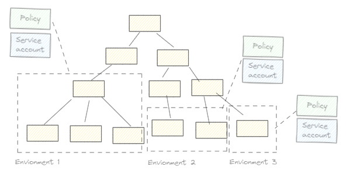

JIT Groups lets you configure one or more _environments_. Environments correspond to segments of your
Google Cloud organizational hierarchy, and you can use environments to delegate the management of
these resources to different teams or business units.

For each environment, JIT Access maintains:

+   A _policy document_ that defines the groups for this environment. 
+   A Secret Manger secret that contains the policy document. 
+   A service account that's used to provision IAM bindings for resources in this environment. 

If you're planning to use a single environment, it's best to create the secret and service account in the
project that contains the JIT Groups application. If you're planning to use multiple environments, and delegate the
administration of these environments to different teams, then it's best to create a deciated project for each
environment and create the secret and service account there.

.


## Register the environment

The steps to register an environment differ depending on whether you're using the project that contains the 
JIT Groups application or a separate project:

=== "Same project"

1.  Copy the example policy document to a file `environment.yaml`:

    ```sh
    cp target/jit-access/sources/src/main/resources/oobe/policy.yaml environment.yaml
    ```

   1.  Open your [existing Terraform configuration](jitgroups-deploy.md) and add the following:

       ```hcl  hl_lines="10 17-24"
       module "application" {
           source                      = "./target/jit-access/terraform/jitgroups-appengine"
           project_id                  = local.project_id
           customer_id                 = "CUSTOMER_ID"
           groups_domain               = "DOMAIN"
           admin_email                 = "ADMIN_EMAIL"
           location                    = "LOCATION"
           iap_users                   = []
           environments                = [ # List of environments, identified by service account
               "serviceAccount:${module.environment.service_account}"
           ]
           options                     = {
               # "APPROVAL_TIMEOUT"    = "90"
           }
       }

       module "environment" {
           source                      = "./target/jit-access/terraform/jitgroups-environment"
           project_id                  = local.project_id
           application_service_account = module.application.service_account
    
           name                        = "NAME"
           policy                      = file("environment.yaml")
       }

       output "url" {
           value                       = module.application.url
       }

       output "service_account" {
           value                       = module.application.service_account
       }
       ```


    Replace `NAME` with the name of the environment. 
    The application uses the environment name as unique identifier and 
    incorporates it into the name of Cloud Identity groups. Names must therefore comply with the following
    restrictions:
 
    +   Names are case-insensitive. You can't have two environments whose names only differ in casing.
    +   Names must be no longer than 16 characters.
    +   Names must only use the following characters: `A-Z`, `a-z`, `0-9`, `-`.

    The name can't be changed later.


1.  Apply the configuration change:

    ```sh
    terraform apply 
    ```

1.  Open a browser and navigate to the URL that you obtained after running `terraform apply`.
1.  Open the environment selector and select your environment.

## Customize the policy

To customize the policy document of your environment, do the following:

1.  In the web interface, click **View policy**.
1.  Use the YAML editor to modify the policy. For details about the syntax, see [policy documents](policy-reference.md).
1.  Click **Validate** to let JIT Groups check the YAML syntax, CEL expressions, and other configuration details.

!!!note

    JIT Groups doesn't have permission to modify the Secret Manager secret and therefore
    doesn't let you save or apply the policy changes in the web interface.

To save and apply your policy changes, do the following:

1.  Copy the updated YAML code to the `environment.yaml` file.

1.  Reinitialize Terraform:

    ```sh
    terraform init 
    ```
    
1.  Run Terraform to apply the configuration:

    ```sh
    terraform apply 
    ```

## What's next

Read more about the format of [policy documents](policy-reference.md).


