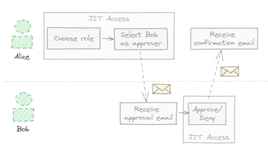

Multi-party approval (MPA) is an optional feature that lets you demand that users solicit approval from a peer before
they can activate certain roles. Multi-party approval is a complement to just-in-time self-approval and differs in the following ways:

<table>
<tr>
    <th></th>
    <th>Self-approval</th>
    <th>Multi-party approval</th>
</tr>
<tr>
    <th>IAM condition</th>
    <td><code>has({}.jitAccessConstraint)</code></td>
    <td><code>has({}.multiPartyApprovalConstraint)</code></td>
</tr>
<tr>
    <th>Activation requirements</th>
    <td>Justification (such as a case number)</td>
    <td>
        <ol>
            <li>Justification (such as a case number)</li>
            <li>Approval from a peer</li>
        </ol>
    </td>
</tr>
</table>

Multi-party approval is handled on a peer-to-peer basis:

*   If two users are granted an MPA-eligible role binding for, say `roles/compute.admin` on `project-1`,
    then they can approve each other’s requests.
*   When soliciting approval, a user can see the list of qualified peers, and can choose the peer(s)
    to request approval from. It’s sufficient to gain approval from a single peer.

The approval process is driven by email, as illustrated by the following example:




1.  Alice opens the JIT Access application, chooses a role, and enters a
    justification for why she needs to activate that role binding (such as `BUG-12345`).
2.  Among the lists of qualified approvers, she selects Bob and requests his approval.
3.  Bob receives an email indicating that Alice seeks his approval to activate a certain role binding.
4.  Following a link in the email, Bob opens the JIT Access application. He sees the resource, role,
    and justification provided by Alice and approves (or disregards) the request.
5.  Alice receives an email confirming that her access has been approved.

## Activation tokens

The Just-in-Time Access application doesn't maintain a database of approval requests and their state.
Instead, the application uses _activation tokens_ to pass information about approval requests between parties.

Activation tokens are JSON Web Tokens (JWTs) that encode all information about an activation request, including:

* The username of the requesting party (beneficiary)
* The email addresses of reviewers
* The requested role and resource
* The start and end time for the activation 

To protect against tampering, the application signs activation tokens using the Google-managed
service account key of its service account.

Example of a decoded activation token:

``` 
{
  "alg": "RS256",
  "kid": "dfdf92ea289752b4a04f43430f613b97e20c8cae",
  "typ": "JWT"
}.{
  "aud": "jitaccess@PROJECTID.iam.gserviceaccount.com",
  "exp": 1672872064,
  "iss": "jitaccess@PROJECTID.iam.gserviceaccount.com",
  "jti": "mpa-okLRSysI53M73mv5",
  "beneficiary": "alice@example.org",
  "reviewers": [
    "bob@example.org"
  ],
  "resource": "//cloudresourcemanager.googleapis.com/projects/my-project-123",
  "role": "roles/compute.admin",
  "justification": "BUG-12345",
  "start": 1672871764,
  "end": 1672872064
}.[Signature]
```

The Just-in-Time Access application embeds an activation token in the email that it sends to reviewers. Reviewers
can then use the token to view and approve a request, provided that:

1. They've authenticated to the Just-in-Time Access application using Identity-Aware-Proxy
2. Their username is included in the list of reviewers in the token
3. They (still) have (MPA-) eligible access to the role and resource listed in the token

The possession of an activation token alone is insufficient to approve a request. Leaking an activation token
to a third party therefore doesn't entitle that party to approve requests. Because users can't choose themselves as reviewers 
when requesting access, users also can't use activation tokens to approve their own requests.

## What's next

* [Configure Multi-party approval](configure-multi-party-approval.md)